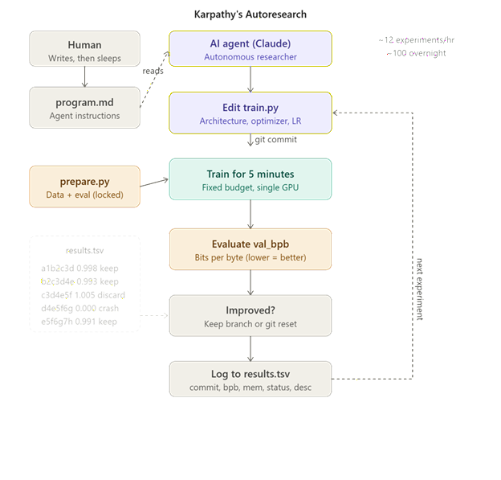
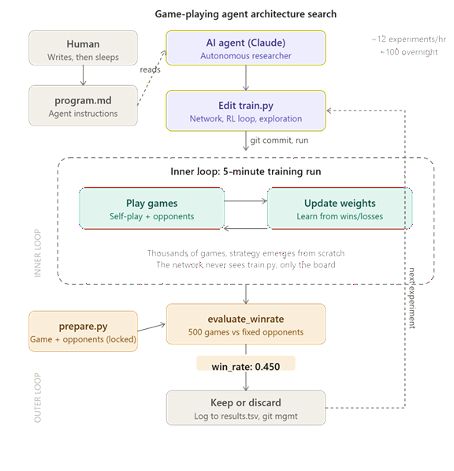

# autoresearch-connect4

Autonomous game-playing agent architecture search for Connect Four, modeled directly on [Karpathy's Autoresearch](https://github.com/karpathy/autoresearch).

The idea: give an AI agent a Connect Four training setup and let it experiment autonomously overnight. It modifies the neural network code, trains for 5 minutes via self-play, checks if the agent plays better, keeps or discards the change, and repeats. You wake up in the morning to a log of experiments and a better game-playing agent.

This project adapts the Autoresearch pattern from LLM pretraining to reinforcement learning. The human writes `program.md` once, then sleeps. The AI agent does the research.


## How it works

The repo has exactly three files that matter, the same three-file architecture as Karpathy's original.

**`prepare.py`** is the immutable harness. In Karpathy's original, this file downloads text data, trains a tokenizer, provides a dataloader, and contains the sacred metric function `evaluate_bpb`. In this Connect Four version, `prepare.py` instead contains the Connect Four game engine (rules, board representation, legal move generation), a fixed suite of four opponents (random player, one-step-lookahead player, minimax depth 3, minimax depth 5), and the sacred metric function `evaluate_winrate` that plays 100 games against each opponent and computes a weighted overall win rate. This file is never modified during experimentation.

**`train.py`** is the single mutable file the AI agent edits. In Karpathy's original, this file contains the GPT model architecture, the Muon+AdamW optimizer, all hyperparameters, and the training loop. In this Connect Four version, `train.py` instead contains a convolutional neural network for evaluating board positions, a REINFORCE policy gradient optimizer, all hyperparameters (network width, exploration rate, self-play ratio, learning rate), and the self-play training loop. Everything in this file is fair game for the agent to change: architecture, optimizer, training procedure, exploration strategy, board encoding, inference-time search. The only constraint is that the code runs without crashing and finishes within the 5-minute time budget.

**`program.md`** is the human's instruction document for the AI agent. It defines the setup procedure, the experiment loop, the logging format, what the agent can and cannot modify, the simplicity criterion, and a list of experiment ideas to try. It also contains the critical "NEVER STOP" directive that keeps the agent running autonomously until the human manually interrupts. This file is written by the human and read by the agent. It is the human's sole lever for steering the autonomous research process.


## The two-level optimization loop

This project has a structural property that Karpathy's original LLM version does not: two nested optimization loops.

The outer loop is the Autoresearch pattern itself. The AI agent edits `train.py`, commits, runs the training script, reads the win_rate from the log, decides whether to keep or discard the change, logs the result, and repeats. This loop runs roughly 12 times per hour, accumulating about 100 experiments overnight.

The inner loop happens inside each 5-minute training run. A neural network plays thousands of Connect Four games against itself, wins some, loses some, adjusts its weights based on the outcomes, and gradually develops a strategy from scratch. This inner loop is a standard reinforcement learning process. The neural network starts from random weights each run, learns for 5 minutes, and then gets evaluated by `prepare.py`'s `evaluate_winrate`.

The AI agent in the outer loop never plays Connect Four, never watches games, and never learns strategy. It only sees the final win_rate number that comes out of `prepare.py` after each training run. Based on that single number, it decides whether the change it made to `train.py` was an improvement. The outer loop learns which blueprints produce the best inner-loop learners. The inner loop learns how to play Connect Four from that blueprint.

## Architecture





## Project structure

```
prepare.py      — game engine, opponents, evaluate_winrate (do not modify)
train.py        — neural network, RL training loop (agent modifies this)
program.md      — agent instructions
analysis.py     — reads results.tsv, generates progress.png chart
report.py       — reads results.tsv + logs/, generates report.md
pyproject.toml  — dependencies
README.md       — this file
```

Generated at runtime (untracked by git):

```
results.tsv     — experiment ledger (one row per experiment)
logs/           — per-experiment full output (named by commit hash)
run.log         — current experiment output (overwritten each cycle)
report.md       — comprehensive morning-after report
progress.png    — visual chart of win_rate over experiments
```


## Quick start on Lightning.ai with an H100

These instructions are written specifically for Lightning.ai Studios, where the terminal cannot open a browser window for OAuth login. The workaround is to use Claude Code in headless mode with the `-p` flag and an API key.


### Step 1: Create a Lightning Studio

Log in to Lightning.ai and create a new Studio with a single H100 GPU. Open the terminal. Lightning Studios use Python 3.12 by default, which is the tested and target version for this project. Verify with:

```bash
python3 --version
```


### Step 2: Install uv

```bash
curl -LsSf https://astral.sh/uv/install.sh | sh
source ~/.bashrc
```


### Step 3: Install Claude Code

```bash
npm install -g @anthropic-ai/claude-code
```


### Step 4: Set your Anthropic API key

Claude Code in interactive mode requires OAuth login via a browser, which is not possible inside a Lightning terminal. The workaround is to set your API key as an environment variable. Claude Code's `-p` flag (headless mode) uses this key directly, bypassing OAuth entirely.

```bash
export ANTHROPIC_API_KEY="sk-ant-your-key-here"
echo 'export ANTHROPIC_API_KEY="sk-ant-your-key-here"' >> ~/.bashrc
source ~/.bashrc
```

Verify the key is set:

```bash
echo $ANTHROPIC_API_KEY
```


### Step 5: Clone and set up the repo

```bash
git clone https://github.com/YOUR_USERNAME/autoresearch-connect4.git
cd autoresearch-connect4
uv sync
```


### Step 6: Verify the setup

```bash
uv run prepare.py
```

This runs the self-tests on the game engine and opponents. You should see "All self-tests passed." and a summary of the configuration.


### Step 7: Run a manual test (optional)

```bash
uv run train.py
```

This trains the baseline model for 5 minutes and evaluates it. Verify that the script completes without errors and prints a summary with `win_rate:` at the end.


### Step 8: Launch the autonomous research loop

This is where the `-p` flag solves the Lightning.ai login problem. Instead of the interactive `claude` command (which requires OAuth via a browser), `-p` sends a prompt directly and uses your API key for authentication. The agent can still edit files, run shell commands, and execute the full experiment loop, it just skips the conversational UI.

```bash
claude -p "Hi, have a look at program.md and let's kick off a new experiment! Let's do the setup first." \
  --dangerously-skip-permissions \
  --max-turns 1000
```

The `--max-turns 1000` flag gives the agent enough headroom to run all night. At roughly 12 experiments per hour, 1000 turns is more than sufficient for 8 hours of autonomous research. The `--dangerously-skip-permissions` flag allows the agent to edit files and run commands without asking for confirmation at each step.

You can now close your laptop, go to sleep, or do anything else. The agent runs autonomously until you manually stop it or it exhausts `--max-turns`.


### Step 9: Review results in the morning

```bash
cd autoresearch-connect4

# Quick summary: see the experiment ledger
cat results.tsv

# Generate a comprehensive markdown report
uv run report.py

# Read the report
cat report.md

# Generate a visual progress chart
uv run analysis.py

# See the git history of kept improvements
git log --oneline

# Review a specific experiment's full training output
ls logs/
cat logs/<commit>.log

# See exactly what train.py looked like at any kept experiment
git show <commit>:train.py

# See what changed between two experiments
git diff <old_commit> <new_commit>
```

The `report.md` file is the most useful starting point. It summarizes the total number of experiments, the keep rate, the improvement timeline showing each kept change and its delta, the biggest single-step wins ranked by impact, any crashes with their error messages, and near-miss discards that came close to improving the win rate and might be worth revisiting. The `logs/` directory preserves the full training output of every experiment, named by commit hash, so you can dig into the per-opponent breakdown for any specific run.


## How evaluation works

The `evaluate_winrate` function in `prepare.py` plays the trained model against four opponents of increasing difficulty. Each opponent gets 100 games, alternating who goes first. The overall win_rate is a weighted average that values wins against harder opponents more:

The random opponent gets a weight of 0.5 (easy to beat, low signal). The one-step-lookahead opponent gets a weight of 1.0 (blocks immediate wins, plays center). The minimax depth-3 opponent gets a weight of 2.0 (looks 3 moves ahead). The minimax depth-5 opponent gets a weight of 3.0 (looks 5 moves ahead, strongest test).

This weighting ensures the metric keeps discriminating as the agent improves. Beating the random opponent 100% adds little to the score. Beating the minimax depth-5 opponent even 30% adds a lot.

The evaluation uses a fixed random seed (42) so that the random opponent plays the same sequence of moves every time, making results reproducible across evaluations of different `train.py` versions.


## Design choices

**Same architecture as Karpathy's original.** Three files, same roles, same names. `prepare.py` is the immutable harness with the sacred metric. `train.py` is the single mutable file. `program.md` is the human's instructions. The experiment loop, logging format, simplicity criterion, and git workflow are identical.

**Fixed 5-minute time budget.** Training always runs for exactly 5 minutes of wall-clock time, regardless of what the agent changes. This makes experiments directly comparable whether the agent uses a tiny 2-layer network or a large convolutional model.

**Self-contained.** No external dependencies beyond PyTorch. No distributed training, no complex configs. One GPU, one file, one metric.

**Connect Four as the game.** Simple enough that a small neural network can learn meaningful strategy in 5 minutes (thousands of games fit in the budget), complex enough that there are real patterns to discover (center control, double threats, forced wins). The game is solved (first player wins with perfect play), which provides a theoretical ceiling for what the agent could achieve.

**REINFORCE as the baseline RL algorithm.** The simplest possible policy gradient method. The agent is expected to discover that more sophisticated approaches (PPO, replay buffers, curriculum learning, MCTS) produce better results. Starting simple gives the agent the most room to improve.


## License

MIT
